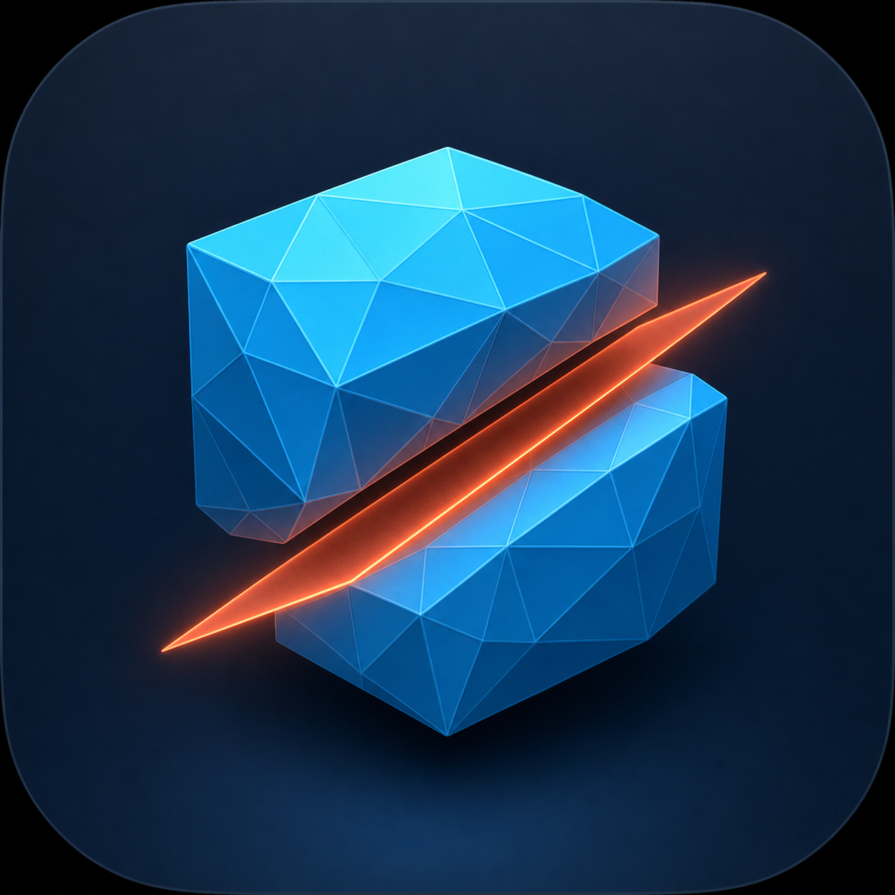
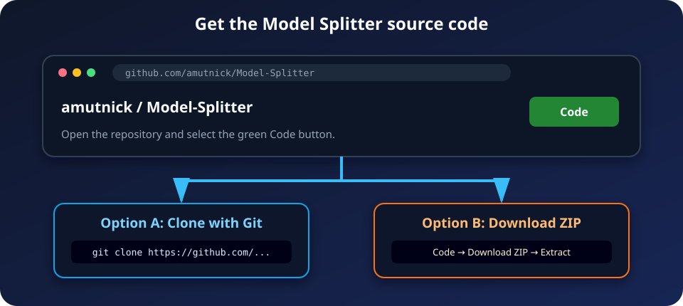
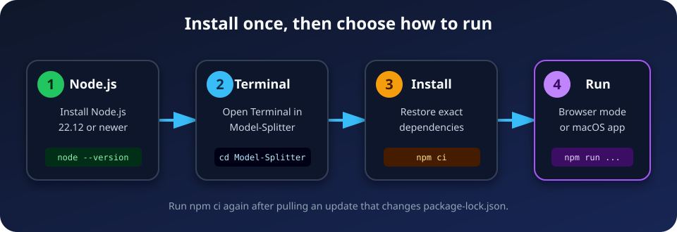
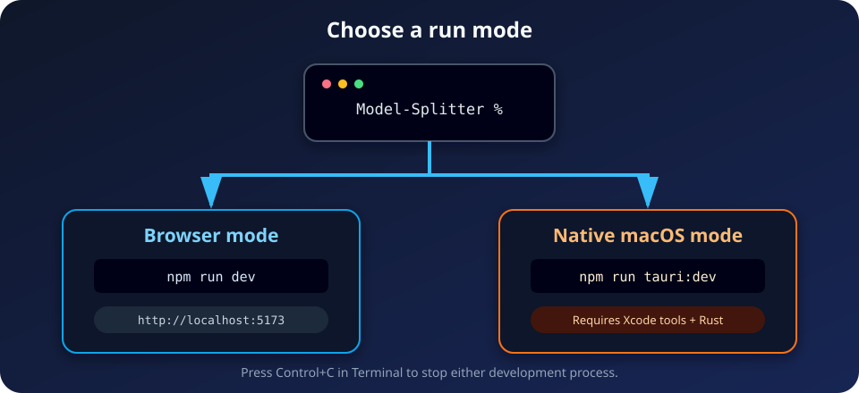
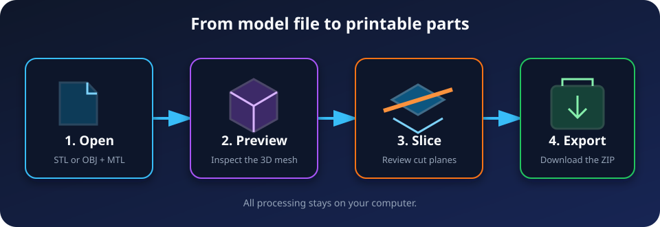

<p align="center">
  
</p>

# Model Splitter: Get, Install, and Run

**[Download the professionally laid-out PDF edition](Model-Splitter-Installation-Guide.pdf)**

This beginner-friendly guide explains how to download Model Splitter and run it either:

1. **In a web browser** — the quickest option on macOS, Windows, or Linux.
2. **As a native macOS app** — adds native open/save dialogs and can produce an installable `.app` and `.dmg`.

> [!IMPORTANT]
> Model Splitter is currently distributed as source code. There is no prebuilt installer in the repository yet, so both options begin by downloading the source and installing its dependencies.

## Before you begin

| Run mode | Operating system | Required software |
| --- | --- | --- |
| Browser | macOS, Windows, or Linux | Node.js and npm |
| Native desktop | macOS 11.3 or newer | Node.js, npm, Xcode command-line tools, and Rust |

You need an internet connection while downloading the source and installing dependencies. Model files remain on your computer while the app is running.

---

## Step 1: Get the source code



Open the repository in a browser:

<https://github.com/amutnick/Model-Splitter>

Choose **one** of the following methods.

### Option A — Clone with Git (recommended)

This method makes future updates easiest.

1. Install [Git](https://git-scm.com/downloads) if it is not already installed.
2. Open **Terminal** on macOS/Linux or **PowerShell** on Windows.
3. Run:

   ```bash
   git clone https://github.com/amutnick/Model-Splitter.git
   cd Model-Splitter
   ```

### Option B — Download a ZIP file

This method does not require Git.

1. On the repository page, select the green **Code** button.
2. Select **Download ZIP**.
3. Open your Downloads folder and extract the ZIP file.
4. Open Terminal or PowerShell and move into the extracted folder.

   macOS/Linux example:

   ```bash
   cd ~/Downloads/Model-Splitter-main
   ```

   Windows PowerShell example:

   ```powershell
   cd "$HOME\Downloads\Model-Splitter-main"
   ```

> [!TIP]
> Folder names can differ. Type `cd ` with a trailing space, drag the extracted folder into the terminal window, and press **Return/Enter**.

---

## Step 2: Install Node.js

Model Splitter requires **Node.js 20.19+ within the Node 20 series, or Node.js 22.12+**. A current Node.js LTS release is recommended. npm is installed with Node.js.

1. Go to <https://nodejs.org/>.
2. Download the **LTS** installer for your operating system.
3. Run the installer and accept its default options.
4. Close and reopen Terminal or PowerShell.
5. Verify the installation:

   ```bash
   node --version
   npm --version
   ```

You should see two version numbers. For example:

```text
v22.22.3
10.9.8
```

If either command is not found, restart your computer or reinstall Node.js and make sure its **Add to PATH** option is enabled.

---

## Step 3: Install Model Splitter dependencies



Make sure the terminal is inside the project folder. The prompt should end in `Model-Splitter` or `Model-Splitter-main`.

Run:

```bash
npm ci
```

npm reads `package-lock.json` and installs the exact dependency versions into a local `node_modules` folder. This can take a few minutes on the first run.

A successful install ends without a red error message. You only need to repeat this step when the lockfile changes or after deleting `node_modules`.

---

## Step 4: Choose how to run the app



### Choice A — Run in a browser

This is the fastest way to start and works on macOS, Windows, and Linux.

1. In the project folder, run:

   ```bash
   npm run dev
   ```

2. Wait for Vite to print an address similar to:

   ```text
   VITE ready
   Local: http://localhost:5173/
   ```

3. Open <http://localhost:5173> in Chrome, Edge, Firefox, or Safari.
4. Keep the terminal window open while using the app.
5. When finished, return to the terminal and press **Control+C** to stop the server.

### Choice B — Run as a native macOS app

Complete the following additional setup on a Mac.

#### 4B.1 Install Xcode command-line tools

Run:

```bash
xcode-select --install
```

Follow the macOS installer prompts. If macOS says the tools are already installed, continue to the next step.

#### 4B.2 Install Rust

Run:

```bash
curl --proto '=https' --tlsv1.2 -sSf https://sh.rustup.rs | sh
```

Choose the default installation when prompted. Then either reopen Terminal or run:

```bash
source "$HOME/.cargo/env"
```

Verify Rust:

```bash
rustc --version
cargo --version
```

#### 4B.3 Launch Model Splitter

From the project folder, run:

```bash
npm run tauri:dev
```

The first launch downloads and compiles the Rust dependencies, so it can take several minutes. Later launches are much faster. When compilation finishes, a **Model Splitter** desktop window opens.

Press **Control+C** in Terminal to stop the development app.

---

## Step 5: Use Model Splitter



1. Select **Browse Files** or drop a model into the window.
2. Choose one of the supported input types:
   - Binary or ASCII `.stl`
   - Wavefront `.obj` with an optional `.mtl`
   - `.3mf` packages with build assemblies and material colours
3. Review the model’s solid/open status and enable **Repair open mesh** if needed.
4. Choose the desired segmentation strategy and options.
5. Select **Slice Model**.
6. In the **Cuts** tab, enable **PEG** on any cut that needs guide pegs and matching sockets.
7. Review the generated parts and cut planes.
8. Select **Download .ZIP** to export the segmented STL files.

The browser version downloads through the browser. The native version opens the macOS Save dialog.

---

## Step 6: Build and install the native macOS app (optional)

This step is only for users who want a reusable `.app` or `.dmg` instead of launching through Terminal each time.

1. On macOS, run from the project folder:

   ```bash
   npm run tauri:build
   ```

2. Wait for the release build to finish.
3. Open the generated bundle folder:

   ```bash
   open src-tauri/target/release/bundle
   ```

4. Open the `dmg` folder and double-click the generated `.dmg` file.
5. Drag **Model Splitter** into the **Applications** folder.
6. Open Model Splitter from Applications.

> [!NOTE]
> Local builds are not automatically signed or notarized. If macOS blocks the first launch, Control-click the app in Finder, choose **Open**, and confirm that you want to open your own build. Do not bypass macOS security warnings for an app obtained from an untrusted source.

---

## Updating the application

### If you cloned with Git

Open a terminal in the project folder and run:

```bash
git pull
npm ci
```

Then launch the desired mode again.

### If you downloaded a ZIP

Download a new ZIP from GitHub, extract it into a new folder, run `npm ci` in that folder, and launch the app again.

---

## Common problems

| Problem | What to do |
| --- | --- |
| `node: command not found` or `npm: command not found` | Reinstall Node.js LTS, reopen the terminal, and verify `node --version`. |
| `npm ci` reports a network error | Check the internet connection, VPN, proxy, or firewall, then retry. |
| Port 5173 is already in use | Stop the other Vite process with **Control+C**, close old terminal sessions, and retry. |
| The browser page does not open automatically | Manually open <http://localhost:5173>. |
| `cargo: command not found` | Reopen Terminal or run `source "$HOME/.cargo/env"`. |
| Xcode or linker errors on macOS | Run `xcode-select --install`, complete any installer, and retry. |
| Native build attempted on Windows/Linux | Build the `.app` and `.dmg` on macOS; use browser mode on other systems. |
| The 3D view is blank or slow | Update the browser and graphics drivers, enable hardware acceleration, and retry with a smaller model. |
| macOS blocks the local app | Control-click the app, select **Open**, and confirm only if you built it yourself. |

For a clean dependency reinstall:

macOS/Linux:

```bash
rm -rf node_modules
npm ci
```

Windows PowerShell:

```powershell
Remove-Item -Recurse -Force node_modules
npm ci
```

---

## Quick command reference

```bash
# Install exact dependencies
npm ci

# Run in a browser
npm run dev

# Validate and build the web app
npm run build

# Preview the web production build
npm run preview

# Run the native macOS development app
npm run tauri:dev

# Create the native macOS .app and .dmg
npm run tauri:build
```

For developer-focused native setup details, see [TAURI_SETUP.md](TAURI_SETUP.md).
